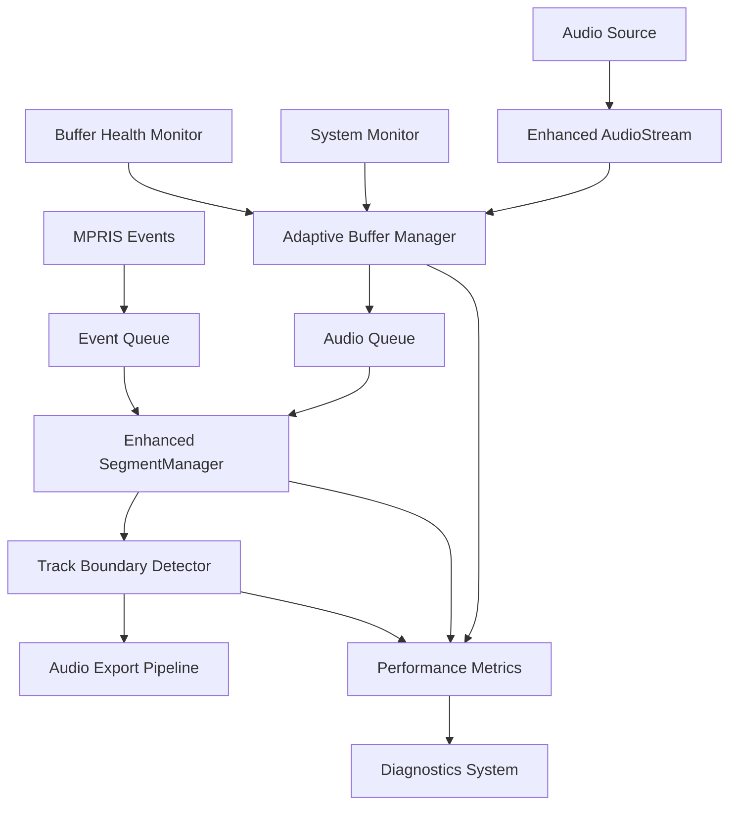

# Audio Buffer Optimization Design Document

## Overview

This design addresses critical audio handling issues in the Spotify Splitter application by implementing adaptive buffer management, improved track boundary detection, and robust error recovery mechanisms. The solution focuses on eliminating buffer overruns during track transitions while maintaining audio quality and system stability across different hardware configurations.Current mechanism for splitting tacks is accurate enough.

The current architecture uses a producer-consumer pattern with separate threads for audio capture and processing, connected by queues. While this design is fundamentally sound, it suffers from static buffer sizing, inadequate error recovery, and timing issues during track transitions that lead to audio dropouts and splitting problems.

## Architecture

### Enhanced Audio Pipeline Architecture



### Core Components Enhancement

**1. Adaptive Buffer Manager**
- Dynamically adjusts buffer sizes based on system performance
- Monitors queue utilization and adjusts parameters in real-time
- Implements emergency buffer expansion during high-load scenarios
- Provides buffer health metrics and early warning systems

**2. Enhanced Track Boundary Detection**
- Uses audio continuity validation to ensure clean splits
- Provides boundary correction mechanisms for timing mismatches
- Maintains audio frame accounting to prevent loss or duplication

**3. Robust Error Recovery System**
- Automatic audio stream reconnection on failures
- Progressive buffer size adjustment on repeated errors
- Comprehensive error diagnostics and logging

## Components and Interfaces

### 1. AdaptiveBufferManager Class

```python
class AdaptiveBufferManager:
    def __init__(self, initial_queue_size: int = 200, 
                 min_size: int = 50, max_size: int = 1000):
        self.current_queue_size = initial_queue_size
        self.min_size = min_size
        self.max_size = max_size
        self.utilization_history = deque(maxlen=100)
        self.adjustment_cooldown = 0
        
    def monitor_utilization(self, queue: Queue) -> BufferMetrics
    def adjust_buffer_size(self, metrics: BufferMetrics) -> int
    def get_optimal_settings(self, system_load: float) -> AudioSettings
    def emergency_expansion(self) -> bool
```

**Key Methods:**
- `monitor_utilization()`: Tracks queue fill levels and timing
- `adjust_buffer_size()`: Dynamically modifies buffer parameters
- `get_optimal_settings()`: Returns configuration based on system state
- `emergency_expansion()`: Handles critical buffer overflow situations

### 2. Enhanced AudioStream Class

```python
class EnhancedAudioStream(AudioStream):
    def __init__(self, monitor_name: str, buffer_manager: AdaptiveBufferManager,
                 error_recovery: ErrorRecoveryManager, **kwargs):
        self.buffer_manager = buffer_manager
        self.error_recovery = error_recovery
        self.metrics_collector = MetricsCollector()
        self.reconnection_attempts = 0
        
    def _adaptive_callback(self, indata, frames, time, status)
    def handle_stream_error(self, error: Exception) -> bool
    def reconnect_stream(self) -> bool
    def get_buffer_health(self) -> BufferHealth
```

**Enhanced Features:**
- Adaptive callback with dynamic buffer management
- Automatic error recovery and stream reconnection
- Real-time buffer health monitoring


### 3. TrackBoundaryDetector Class

```python
class TrackBoundaryDetector:
    def __init__(self, grace_period_ms: int = 500):
        self.grace_period_ms = grace_period_ms
        self.boundary_cache = {}
        self.continuity_validator = AudioContinuityValidator()
        
    def detect_boundary(self, audio_buffer: AudioSegment, 
                       markers: List[TrackMarker]) -> BoundaryResult
    def validate_continuity(self, before: AudioSegment, 
                           after: AudioSegment) -> bool
    def correct_boundary(self, boundary: int, 
                        audio_buffer: AudioSegment) -> int
    def apply_grace_period(self, timestamp: int) -> Tuple[int, int]
```

**Key Features:**
- Grace period implementation for track transitions
- Audio continuity validation across boundaries
- Boundary correction algorithms for timing mismatches
- Frame accounting to prevent audio loss

### 4. ErrorRecoveryManager Class

```python
class ErrorRecoveryManager:
    def __init__(self, max_retries: int = 3, backoff_factor: float = 1.5):
        self.max_retries = max_retries
        self.backoff_factor = backoff_factor
        self.error_history = deque(maxlen=50)
        self.recovery_strategies = {}
        
    def handle_error(self, error: Exception, context: str) -> RecoveryAction
    def attempt_recovery(self, action: RecoveryAction) -> bool
    def escalate_error(self, error: Exception) -> None
    def get_diagnostics(self) -> ErrorDiagnostics
```

## Data Models

### BufferMetrics
```python
@dataclass
class BufferMetrics:
    utilization_percent: float
    queue_size: int
    overflow_count: int
    underrun_count: int
    average_latency_ms: float
    peak_latency_ms: float
    timestamp: datetime
```

### AudioSettings
```python
@dataclass
class AudioSettings:
    queue_size: int
    blocksize: int
    latency: float
    channels: int
    samplerate: int
    buffer_strategy: BufferStrategy
```

### BoundaryResult
```python
@dataclass
class BoundaryResult:
    start_frame: int
    end_frame: int
    confidence: float
    continuity_valid: bool
    grace_period_applied: bool
    correction_applied: bool
```

### BufferHealth
```python
@dataclass
class BufferHealth:
    status: HealthStatus  # HEALTHY, WARNING, CRITICAL
    utilization: float
    overflow_risk: float
    recommended_action: Optional[str]
    metrics: BufferMetrics
```

## Error Handling

### Error Classification and Recovery Strategies

**1. Buffer Overflow Errors**
- **Detection**: Monitor queue utilization above 80%
- **Recovery**: Emergency buffer expansion, frame dropping with quality preservation
- **Prevention**: Adaptive buffer sizing, system load monitoring

**2. Stream Disconnection Errors**
- **Detection**: Audio callback failures, device unavailable errors
- **Recovery**: Automatic reconnection with exponential backoff
- **Prevention**: Device change monitoring, connection health checks

**3. Timing Synchronization Errors**
- **Detection**: Track duration mismatches, boundary validation failures
- **Recovery**: Boundary correction algorithms, grace period application
- **Prevention**: Improved timing coordination, buffer pre-loading

**4. System Resource Errors**
- **Detection**: High CPU usage, memory pressure indicators
- **Recovery**: Conservative buffer settings, reduced processing load
- **Prevention**: System capability detection, adaptive configuration

### Recovery Escalation Path

1. **Level 1**: Automatic parameter adjustment (buffer size, latency)
2. **Level 2**: Stream reconnection with backoff
3. **Level 3**: Emergency buffer expansion or frame dropping
4. **Level 4**: Graceful degradation with user notification
5. **Level 5**: Error reporting with diagnostic information

## Testing Strategy

### Unit Testing Approach

**1. Buffer Management Testing**
- Buffer utilization calculation accuracy
- Dynamic sizing algorithm correctness
- Emergency expansion trigger conditions
- Metrics collection and reporting

**2. Audio Processing Testing**
- Track boundary detection accuracy
- Audio continuity validation
- Frame accounting correctness
- Quality preservation during error recovery

**3. Error Recovery Testing**
- Stream reconnection reliability
- Error escalation path validation
- Recovery strategy effectiveness
- Diagnostic information accuracy

### Integration Testing Scenarios

**1. High-Load Scenarios**
- Continuous recording under system stress
- Multiple concurrent audio streams
- Memory pressure conditions
- CPU saturation scenarios

**2. Hardware Variation Testing**
- Different audio device configurations
- Sample rate and channel variations
- Latency sensitivity testing
- Device disconnection/reconnection

**3. Long-Running Session Testing**
- Extended recording sessions (8+ hours)
- Memory leak detection
- Buffer performance degradation
- Error accumulation patterns

### Performance Testing Metrics

**1. Buffer Performance**
- Queue utilization distribution
- Overflow/underrun frequency
- Latency measurements
- Adaptation response time

**2. Audio Quality Metrics**
- Track boundary accuracy
- Audio continuity validation
- Frame loss/duplication detection
- Export quality verification

**3. System Resource Usage**
- Memory consumption patterns
- CPU utilization profiles
- Thread synchronization efficiency
- Error recovery overhead

### Test Environment Configuration

**1. Simulated Load Testing**
- Artificial system load generation
- Controlled audio stream interruption
- Device state manipulation
- Network latency simulation

**2. Real-World Scenario Testing**
- Various Linux distributions
- Different audio backends (PulseAudio/PipeWire)
- Multiple Spotify client types
- Hardware configuration variations

This comprehensive design provides a robust foundation for eliminating buffer overruns and audio splitting issues while maintaining backward compatibility and system performance across diverse hardware configurations.