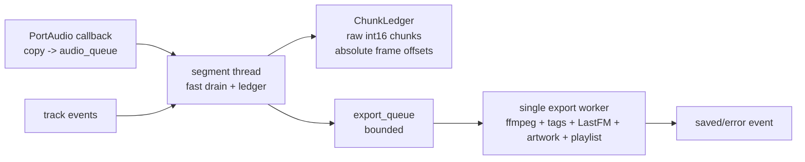

# Pass 2 Pipeline Design

Status: draft for implementation - Date: 2026-06-08

## Goal

Remove the two hot-path failure modes that still remain after the engine extraction:

- audio ingest copies an ever-growing `AudioSegment`, which creates O(n²) CPU and
  allocation cost during long recordings
- track export runs on the same thread that drains `audio_queue`, so ffmpeg, tagging,
  LastFM, and artwork can delay capture of the next track

Pass 2 changes the pipeline internals only. The CLI, web service, status/control
channels, file naming, tagging semantics, and playlist output should behave the same.

## Non-goals

- Do not collapse the error-recovery maze yet; that is Pass 3.
- Do not merge `AudioStream` and `EnhancedAudioStream` yet; the callback is already
  enqueue-only, but class cleanup is Pass 3.
- Do not move web pause/resume from signals to cooperative commands.
- Do not change the public `RecorderEngine` frontend contract.
- Do not introduce multiple export workers in this pass.

## Current Problem

Today `SegmentManager.run()` does three jobs on one thread:

1. drain `audio_queue`
2. cut track boundaries
3. export, tag, fetch metadata, fetch artwork, and append playlist entries

That means a slow export stops queue draining. If export takes longer than the queued
audio capacity, the PortAudio callback drops frames and the next track can lose its
opening.

The ingest path also builds tiny `AudioSegment` objects for each audio block and then
appends them to `continuous_buffer`. `AudioSegment` is immutable, so repeated
`continuous_buffer += segment` copies the growing buffer.

## Target Shape



The segment thread remains the only owner of boundary state. The export worker becomes
the only owner of export state.

## Ledger Representation

Introduce a small `ChunkLedger` owned by `SegmentManager`.

```python
@dataclass
class AudioChunk:
    start_frame: int
    samples: np.ndarray  # int16, shape=(frames, channels)

class ChunkLedger:
    base_frame: int
    total_frames: int
    chunks: list[AudioChunk]

    def append_float32(self, frames: np.ndarray) -> None: ...
    def slice_frames(self, start_frame: int, end_frame: int) -> np.ndarray: ...
    def to_audio_segment(self, start_frame: int, end_frame: int) -> AudioSegment: ...
    def discard_before(self, frame: int) -> None: ...
```

`append_float32()` clips to `[-1.0, 1.0]`, converts to int16, and appends a chunk. This
moves the existing safe conversion from export time to ingest time. Marker offsets use
absolute frame numbers, not milliseconds.

The ledger never materializes the whole session. It materializes only the candidate
track window when a complete segment exists.

## Marker And Boundary Semantics

Replace `TrackMarker.timestamp` usage in the ingest path with frame offsets. The
transition can keep the namedtuple field name briefly for compatibility, but new code
should treat it as `frame`.

The existing `TrackBoundaryDetector` works with `AudioSegment` millisecond indexes. To
avoid rewriting it in the same slice:

1. compute the candidate frame window for `start_marker` to `end_marker`
2. include the existing grace window in frames
3. materialize that candidate window once as an `AudioSegment`
4. pass detector markers converted to millisecond offsets relative to the candidate
5. convert the detector result back to absolute frame offsets for ledger cleanup

This keeps the detector contract stable while removing the growing session buffer.

## Export Jobs

The segment thread creates an export job only after duration and boundary validation
pass.

```python
@dataclass
class ExportJob:
    sequence: int
    audio: AudioSegment
    track_info: TrackInfo
```

The first implementation should pass an `AudioSegment` to the export worker. This
keeps `_export()` behaviour almost unchanged and avoids mixing the ledger rewrite with
a tag/export rewrite. The job still holds one full track in memory, not the full
session.

The export worker calls the existing export path:

- `AudioSegment.export(...)`
- ID3/EasyID3 tagging
- LastFM metadata lookup
- artwork download
- playlist append
- `ui_callback("saved", track_info)`

## Backpressure And Memory Bound

Use one export worker and a bounded `queue.Queue(maxsize=2)` by default.

A four-minute stereo 44.1 kHz int16 track is roughly 40 MB before encoder overhead.
With `maxsize=2`, the normal worst case is two queued tracks plus the active export.
That is large but bounded.

If the export queue fills, the segment thread must not block forever. The initial
policy is:

1. try `put(job, timeout=1.0)`
2. if still full, emit a warning/error event and continue trying in one-second waits
3. while waiting, keep draining `audio_queue` into the ledger between attempts

This preserves audio capture at the cost of allowing the ledger to grow if exports are
slower than real time for a sustained period. That is preferable to dropping frames.
Pass 2 measurement should prove the queue normally stays at depth 0-1.

Do not drop export jobs. Skipping a finished track is a worse default than temporary
memory growth.

## Thread Ownership

Segment thread owns:

- `audio_queue` draining
- `event_queue` consumption
- `ChunkLedger`
- `track_markers`
- boundary detection
- frame cleanup after a job is accepted by the export queue

Export worker owns:

- `export_queue`
- `requests.Session` for artwork
- `bundle_album_art`
- bundle track number
- playlist file writes and duplicate tracking
- LastFM calls through the reused global client
- `AudioSegment.export()` and tagging

Shared fields should be minimal. Counters exposed to status/UI, such as saved count or
export queue depth, need a small lock or atomic snapshot helper. The artwork session is
used only by the export worker; if future work adds more export workers, each worker
gets its own session.

## Shutdown Order

Shutdown must not let post-run finalization outrun export drain.

`SegmentManager.shutdown_cleanup()` should:

1. drain any remaining `audio_queue` frames into the ledger
2. process all complete marker pairs into export jobs
3. enqueue an export sentinel
4. wait for the export worker in short intervals, emitting progress warnings if it
   takes longer than expected
5. return only after the export worker has drained or after the process is forcefully
   terminated by the outer supervisor

`RecorderEngine.stop(flush=True)` must call `shutdown_cleanup()` before it publishes
`stopped`. `RecorderEngine.finalize_post_run()` must run only after the export worker
has finished, so the external tagger sees the final saved tracks and the playlist is
complete.

Export-owned resources, including the playlist file and artwork session, must close
after the worker has drained, not while jobs can still append playlist entries or
download artwork.

## Failure Policy

Keep the existing export error policy during Pass 2:

- tag/art/LastFM failures are non-fatal
- export failures follow the current `_export_with_error_handling()` path
- a failed export records/logs the failure and the worker advances to the next job

Do not add broad new recovery branches in this pass. Pass 3 will simplify that code.

## Measurement

Add lightweight counters before or during the implementation:

- callback buffer overflows / dropped blocks
- `audio_queue` depth high-water mark
- ledger retained frames / retained seconds high-water mark
- export queue depth high-water mark
- per-track export duration

Log a session summary at shutdown. Use a live back-to-back-track run to compare before
and after Pass 2.

## Migration Steps

1. Add `ChunkLedger` with focused tests for append, slice, discard, clipping, and
   frame-to-`AudioSegment` conversion.
2. Switch `_ingest_audio()` to append to the ledger while keeping existing segment
   processing semantics.
3. Convert markers from `len(continuous_buffer)` milliseconds to absolute frames.
4. Materialize only candidate track windows for boundary detection and export.
5. Add `ExportJob`, export queue, and single export worker.
6. Move export-owned state to the worker path: artwork session, bundle art cache,
   bundle track counter, playlist writes.
7. Update `shutdown_cleanup()` to drain the export queue before returning.
8. Add metrics and run the fast suite after each slice.

## Acceptance

- `.venv/bin/pytest -m "not slow"` remains green.
- Track filenames, tags, playlist entries, and bundle playlist behaviour stay the same.
- Ctrl-C, timer expiry, web stop, and normal processing exit flush and export the last
  complete track before `finalize_post_run()` runs.
- A live back-to-back-track session shows no frame drops caused by export latency.
- Long-session memory stays bounded by ledger retention plus the bounded export queue,
  not by a growing `AudioSegment`.
