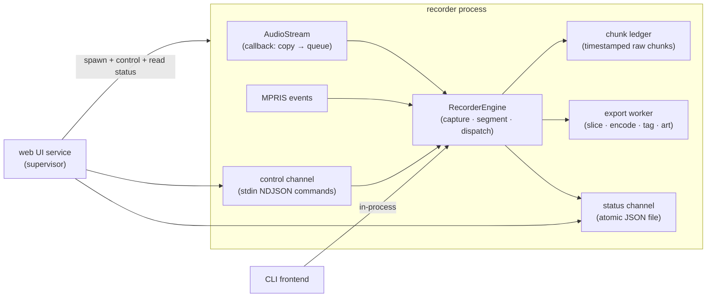

# Refactor Roadmap — Core-First Engine Extraction (Option B2)

Status: **planning** · Owner: Marc · Last updated: 2026-06-08

## Goal

Make recording **reliable** and the codebase **smaller and clearer**, by extracting a
single `RecorderEngine` that owns the capture→events→segment→export pipeline, and
turning the CLI and web UI into thin frontends that talk to it. Keep the recorder in
its **own process** (B2) for crash isolation; replace log-file scraping with a
structured status/control channel.

This is a refactor toward a destination, executed in risk-bounded passes. Each pass is
independently shippable and guarded by the test suite.

## Guiding principles

- **Tests first, every pass.** Nothing in the pipeline changes without the suite runnable and green.
- **Real-time path is sacred.** The PortAudio callback does one thing: enqueue a copy. No locks, no allocation beyond the copy, no metrics.
- **Slow work never blocks capture.** Network (LastFM, artwork), ffmpeg encode, and tagging run off the capture/segment path.
- **Simple defaults.** Fixed known-good buffer settings by default; adaptive/telemetry behaviour is opt-in.
- **Delete speculative code.** Recovery/optimizer branches that don't change real recording success are removed, not relocated.
- **Measure, don't assert.** Dropped frames and per-track export time are captured before/after pipeline changes.

## Target architecture (B2)



- **CLI**: imports and runs `RecorderEngine` directly (in-process).
- **Web service**: stays a supervisor that spawns the recorder as a subprocess
  (preserves restart-on-failure and crash isolation), but communicates via the
  **control channel** and **status channel** instead of `SIGSTOP` + log grepping.
- **`RecorderEngine`**: the one place that knows the pipeline; both frontends are thin.

---

## Pass 0 — Runnable test environment (prerequisite)

**Why:** 306 tests exercise `SegmentManager`/`AudioStream` directly; the refactor moves
those seams. We must see what breaks and why. Bare `pytest` currently fails (system
Python 3.14, no numpy).

- [x] Pin a dev environment (`uv` + Python 3.11 + `requirements-dev.txt`).
- [x] `pytest -m "not slow"` green; document the command in `docs/developer-guide.md`.
- [ ] Make collection resilient: skip (not error) when `numpy`/`sounddevice` are absent, so partial envs degrade gracefully.
- [ ] CI runs the fast suite on 3.10–3.12.

**Local baseline:** `.venv/bin/pytest -m "not slow"` passes
(`297 passed, 28 deselected` in 38.50s on Python 3.11.14 / pytest 8.4.1).

**Acceptance:** a documented one-liner runs the suite green locally and in CI.

---

## Pass 1 — Establish the seam (low behaviour change)

Extract the engine and the structured channels. Structure changes; pipeline internals
do **not** yet.

- [ ] Create `RecorderEngine` (new module, e.g. `spotify_splitter/engine.py`) that owns:
  audio stream lifecycle, MPRIS subscription, the segment manager, and start/stop/pause/resume.
- [x] Define **structured recorder state** (dataclass): `state`, `current_track`,
  `tracks_recorded`, `timer_*`, `dropped_frames`, `queue_depth`, `last_error`.
- [ ] **Status channel:** engine writes state to a JSON file (atomic write) on change/tick.
- [ ] **Control channel:** engine accepts start/stop/pause/resume/reconfigure commands
  as newline-delimited JSON from stdin when run as the web-owned subprocess.
- [ ] CLI `record` becomes a thin wrapper over `RecorderEngine`.
- [ ] Web service reads the status channel instead of grepping `recorder.log`
  (`service_app.py` `_serve_logs`/status), and sends control commands instead of
  raw `SIGSTOP`/`SIGCONT`/process kill where practical.
- [ ] Confirm **all shutdown paths** (Ctrl-C, timer expiry, web stop, restart) flush
  buffers and finalize the active track via one shared cleanup routine. *(timer/Ctrl-C
  already unified in `main.py`; extend to the web/stop path.)*

**Acceptance:** CLI and web UI behave as before from the user's view, but the web UI no
longer parses logs for status, and shutdown is provably single-pathed. Tests updated to
the new seams, green.

**Progress:** `spotify_splitter.recorder_status` defines the schema and atomic JSON
writer. The current `record` command can write it with `--status-file`; engine and
web-service `/status` now consumes it with supervisor-owned lifecycle state. Engine
extraction remains open. Stdin NDJSON control is wired for graceful stop; pause/resume
remain signal-based until `RecorderEngine` owns cooperative pause state.

**Design note:** see `docs/pass1-engine-design.md` for the planned engine API, state
split, thread ownership, and migration steps.

**Extraction progress:** `spotify_splitter.engine` now defines domain exceptions,
`RecorderEngineConfig`, and the first `RecorderEngine` runtime shell. `record()` builds
the resolved config before constructing the current pipeline, and the engine now owns
runtime queues, stream context entry/exit, the segment-processing thread lifecycle,
MPRIS and buffer-health thread startup, the stdin control reader, timer tick state,
and the lifecycle/heartbeat loop that drives timer expiry and normal-exit cleanup
through the guarded stop/control path. `start()` now unwinds an entered stream on
partial startup failure.

---

## Pass 2 — Fix the hot path inside the engine (isolated, the reliability win)

Now localized behind the engine boundary.

- [ ] **Chunk ledger:** replace the growing `pydub.AudioSegment` (`segmenter.py`
  `_ingest_audio` / `continuous_buffer +=`, O(n²)) with timestamped raw int16 chunks
  (bytearray or list of arrays). Track marker offsets in **frames**; materialize an
  `AudioSegment` only when slicing a finished track.
- [ ] **Decouple export:** capture/segment loop only drains the audio queue and cuts
  boundaries; finished `(slice, track_info)` jobs go to an **export worker queue**.
  ffmpeg/LastFM/artwork run there, never blocking capture.
- [ ] **Slim the callback:** `EnhancedAudioStream._adaptive_callback` → enqueue only.
  Move health sampling to the existing 1 s monitor thread. Drop the no-op adaptive
  resize (`audio.py` ~310).
- [ ] **Hard limits/timeouts** confirmed around metadata, artwork, tagging, export
  (artwork timeouts already added; verify LastFM + ffmpeg have bounds).
- [ ] **Reuse a `requests.Session`** for artwork; ensure the LastFM client (already
  caches) is reused, not re-created per track.

**Acceptance:** measured drop — dropped-frame count on a back-to-back-track session at
or near zero, and per-track export no longer correlates with frame drops on the *next*
track. Long-session CPU/memory flat (no O(n²) growth).

---

## Pass 3 — Streamline

- [ ] **Collapse the recovery maze** in `segmenter.py` (~600 lines across
  `_process_segment_with_recovery`, `_export_with_error_handling`, `_attempt_*`,
  `_export_with_minimal_processing`) to one policy: try export (retry only transient
  I/O), else log + skip + advance. Remove dead branches (e.g. unused `alt_path`,
  `segmenter.py` ~971).
- [ ] **Gate telemetry behind `--debug`:** default off. Strong candidate to delete
  `performance_optimizer` (never applies anything). Keep lightweight counters only.
- [ ] **Merge the two `AudioStream` classes** once the callbacks are identical; handle
  "stream died → restart" at the supervisor level.
- [ ] **Split oversized modules:** pull embedded HTML/CSS/JS out of `service_app.py`
  (1339 lines) into a template file; break up `main.py`, `segmenter.py`, `audio.py`
  along the new engine seams.
- [ ] **Single-thread Rich rendering:** keep `Live.update()` on the CLI/main thread by
  rendering from engine status snapshots instead of updating Rich from MPRIS,
  processing, and lifecycle callbacks.

**Acceptance:** net line count down materially; each module has a single clear job; no
behaviour regression in the suite or a real recording check.

---

## Cross-cutting: measurement & verification

- [ ] Instrument dropped frames (overflow/`buffer_warning` events already exist) and
  per-track export duration; log a session summary.
- [ ] Keep a manual "real recording" checklist: record a known playlist, verify track
  count, boundaries, tags, and no gaps at track starts.
- [ ] Capture a before/after on Pass 2 to prove the reliability claim.

## Decisions log

- **2026-06-07** — Direction set to **Option B (engine extraction)**, process model
  **B2 (separate recorder process + structured IPC)** for crash isolation. Rejected
  B1 (in-process engine in the web server) to avoid coupling UI uptime to recorder
  crashes.
- **2026-06-07** — Pass 1 transport set to **atomic JSON status file** plus
  **newline-delimited JSON control commands over subprocess stdin**. Rejected a Unix
  domain socket for now because polling status already fits the web UI, stdin control
  is lifecycle-bound to the child process, and the socket lifecycle would add code
  before there is a push/bidirectional requirement.

## Pass 1 design note — status/control transport

### Status

The recorder writes a single JSON status document to a configured path using atomic
replace:

1. Serialize state to a temp file in the same directory.
2. Flush and fsync the temp file.
3. `rename`/`replace` it over the previous status file.

The web service continues polling its existing `/status` endpoint, but the endpoint
reads this status file instead of grepping `recorder.log`. This keeps the status
channel inspectable with normal shell tools, restart-safe, and independent of log
wording.

Suggested initial shape:

```json
{
  "schema_version": 1,
  "pid": 12345,
  "state": "recording",
  "current_track": {
    "artist": "Artist",
    "title": "Title",
    "album": "Album",
    "duration_ms": 180000,
    "position": 42.1
  },
  "tracks_recorded": 12,
  "timer": {
    "enabled": true,
    "elapsed_seconds": 600,
    "remaining_seconds": 1200
  },
  "audio": {
    "queue_depth": 8,
    "dropped_frames": 0,
    "buffer_warnings": 0
  },
  "last_error": null,
  "updated_at": "2026-06-07T14:30:00Z"
}
```

### Control

When the web service owns the recorder subprocess, it sends one newline-delimited JSON
command per line to the child's stdin:

```json
{"cmd":"pause","request_id":"..."}
{"cmd":"resume","request_id":"..."}
{"cmd":"stop","request_id":"...","flush":true}
```

The recorder reads stdin on a small non-audio thread and translates commands into the
same engine methods used by the in-process CLI. Command handling must never touch the
PortAudio callback or block audio queue draining.

This replaces ad hoc `SIGSTOP`/`SIGCONT`/kill control in the web service with explicit
commands while preserving B2 crash isolation. A Unix domain socket remains a later
option if the UI needs push updates or multiple controllers.

## Open questions

- Do we keep adaptive buffer management at all, or settle on fixed profiles + manual
  overrides? (Lean: keep the *profiles*, drop the runtime adaptive resize since it's
  currently a no-op.)
